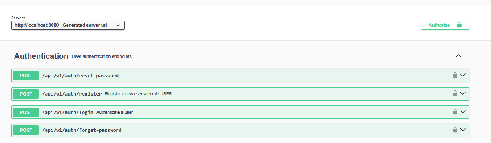
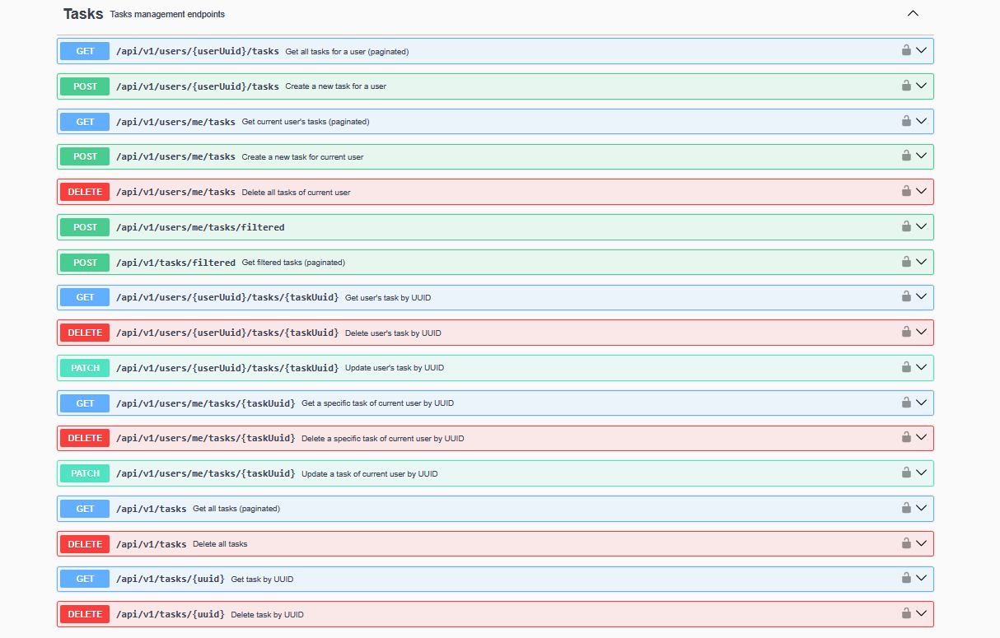
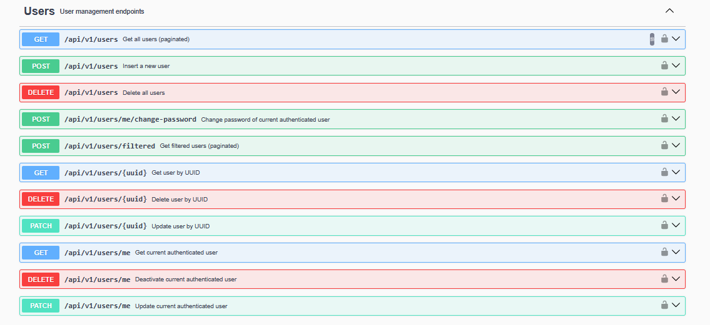
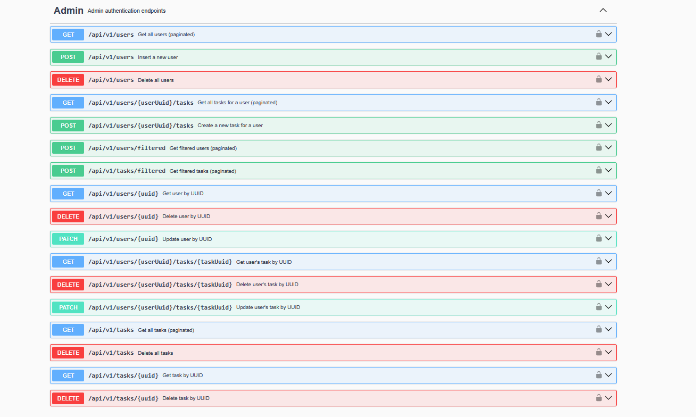

# 🧠 Tasks Management API

A secure RESTful API for **user and task management**, built using **Java Spring Boot**. The API supports:

- 🔐 Role-based access (USER & ADMIN)
- 📝 Task creation, assignment, filtering
- 👤 JWT-based authentication & current user endpoints
- 🧹 Soft deletes & full admin controls
- 📘 OpenAPI 3.1 documentation

---

## ⚙️ Tech Stack

- Java 21
- Spring Boot
- Spring Security (JWT)
- Spring Data JPA
- Spring Email (Spring Boot Starter Mail)
- Gradle
- Swagger / OpenAPI 3.1

---

## 🚀 Getting Started

### ✅ Prerequisites

- Java 17+
- Gradle
- MySQL


1. Clone the repository:
    ```bash
    git clone git@github.com:nickTheof/spring-rest-tasks-app.git
    cd spring-rest-tasks-app
    ```

2. Set up the database credentials in `application.properties`.

3. Set up the email service in `application.properties`.

4. Run the application:
    ```bash
    ./gradlew bootRun
    ```


## ⚙️ Setup Instructions

### 1️⃣ Create the Database & User

Use MySQL to create the database schema and user for the application:

    ```sql
    CREATE DATABASE tasks_app;
    CREATE USER 'task_user'@'localhost' IDENTIFIED BY 'your_password';
    GRANT ALL PRIVILEGES ON tasks_app.* TO 'task_user'@'localhost';
    FLUSH PRIVILEGES;
    ```

### 2️⃣ Configure Application Properties

Update the connection details and other environment variables in:

    ```
    src/main/resources/application.properties
    src/main/resources/application-test.properties
    src/main/resources/application-prod.properties
    src/main/resources/application-stage.properties
    ```

### 3️⃣ Manually Create the First Admin User

Insert an admin user manually into your MySQL database with a **BCrypt-hashed password**.
Alternatively, insert an admin user with plain text password and then use /api/v1/auth/forget-password 
to reset password via email service

    ```sql
    INSERT INTO users (username, password, role, is_active, created_at, updated_at, uuid, last_password_change)
    VALUES (
      'admin@example.com',
      '$2a$10$abcdefghijk1234567890hashedPasswordHere',
      'ADMIN',
      true,
      NOW(),
      NOW(),
      UUID(),
      NOW()
    );
```


### ▶️ Run Locally

```bash
./gradlew bootRun
```

---

## 🔐 Authentication

All secured endpoints require a **JWT Bearer Token**.

- **Login**: `POST /api/v1/auth/login`
- **Register**: `POST /api/v1/auth/register`

Use this header in subsequent requests:
```
Authorization: Bearer <your_token>
```

---

## 📚 API Endpoints Sample

### 🔐 Authentication

| Method | Endpoint                       | Description           |
|--------|--------------------------------|-----------------------|
| POST   | `/api/v1/auth/login`           | Login user            |
| POST   | `/api/v1/auth/register`        | Register new user     |
| POST   | `/api/v1/auth/forget-password` | Send password reset email |
| POST   | `/api/v1/auth/reset-password`  | Reset password with token |
---

### 👤 Current User (`/api/v1/users/me`)

| Method | Endpoint                          | Description                           |
|--------|-----------------------------------|---------------------------------------|
| GET    | `/api/v1/users/me`                | Get current authenticated user        |
| PATCH  | `/api/v1/users/me`                | Update user profile                   |
| DELETE | `/api/v1/users/me`                | Deactivate (soft delete) user         |
| POST   | `/api/v1/users/me/tasks`           | Create a task for current user        |
| POST   | `/api/v1/users/me/tasks/filtered`  | Get paginated-filtered tasks of user  |
| GET    | `/api/v1/users/me/tasks/{uuid}`   | Get specific task by UUID             |
| PATCH  | `/api/v1/users/me/tasks/{uuid}`   | Update a task of the current user     |
| DELETE | `/api/v1/users/me/tasks/{uuid}`   | Delete a task of the current user     |


---

### 🧑‍💼 Admin - Tasks

| Method | Endpoint                | Description                              |
|--------|-------------------------|------------------------------------------|
| GET    | `/api/v1/tasks`         | Get all tasks (paginated)                |
| POST   | `/api/v1/tasks/filtered`| Get all tasks (paginated and filtered)   |
| DELETE | `/api/v1/tasks`         | Delete all tasks                         |
| GET    | `/api/v1/tasks/{uuid}`  | Get task by UUID                         |
| DELETE | `/api/v1/tasks/{uuid}`  | Delete task by UUID                      |

---

## 📘 Swagger UI

After starting the server, visit:

> http://localhost:8080/swagger-ui/index.html

---

## 🛡️ Security

- JWT authentication with bearer tokens
- Role-based access control (ADMIN vs USER)
- Data validation and standard error formats (`ApiErrorDTO`)
- Inactive user fails to authenticate

---

## 🖼️ Screenshots
### Swagger






## 📄 License
This project is licensed under the MIT License - see the [LICENSE](licence.txt) file for details.